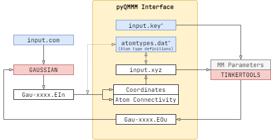

PyQMMM
===

<!--  -->

Python interface for subtractive QM/MM calculations with AMOEBA polarizable force field (PyQMMM) acts as an interface between Gaussian and Tinker. It does not require third party Python packages, therefore, works with the default Python installation in the system (version 3.6 or higher).  Once Gaussian executes the external molecular mechanics software by keyword `external`,  PyQMMM converts the Gaussian input data (`*.EIn`) in to Tinker compatible inputs (`*.xyz`) and then executes the Tinker calculation. Finally, the MM data (`*.epout`, `*.gout`, `*.hes`) is recovered to construct Gaussian compatible data source (`*.EOu`) to continue the QM/MM calculation in Gaussian. Incorporation of Tinker tools enables users to utilise a wide range of MM force fields such as MM3, OPLS, CHARMM, AMBER and AMOEBA. 

## Installation

Download the program code from <https://github.com/madhurangar/pyqmmm> and extract it. (we assume that you have extracted to " `~/`")

```bash
cd ~/pyqmmm
# set permissions
chmod +x pyqmmm.py
```

## Example Calculation

pyQMMM requires 3 input files and the parameter file for Tinker. 

1. `*.com`: Gaussian input file
2. `input.key`: Tinker keywords file 
3. `atomtypes.dat`: stores Gaussian and Tinker atomtypes

### Gaussian16 input
Gaussian uses `external` keyword to execute third party programs in ONIOM calculations. 

```bash
#p opt(cartesian,maxcyc=100,nomicro) freq=noraman nosymm oniom(wb97xd/6-31G*:external="/home/user/pyqmmmm/pyqmmm.py") geom=connectivity
```

### `input.key` 
Tinker reads  `input.key` prior to the calculation to locate parameter file and necessary MM calculation details. The potential energy calculation however needs only the parameter file. Additionally, two optional keywords for pyQMMM (`g16_scratch` and `tinker_path`) can be also defined here. 

```bash
parameters /path/to/parameters/amoeba09.prm

# Optional keywords for pyQMMM
#-----------------------------
g16_scratch /path/to/scratch/scr-water
tinker_path /home/useer/apps/tinker
```

- `g16_scratch`: pyQMMM automatically reads `$GAUSS_SCRDIR` from the system. Users can manually override by specifying it here.
- `tinker_path`: If Tinker executables are not in the system path, users can  specify Tinker binaries folder here. 

### `atomtypes.dat` 

Tinker needs correct atomtypes to calculate MM potential energy . Therefore, Gaussian atoms/atomtypes must be converted to corresponding Tinker atomtypes. `atomtypes.dat` contains both these atomtypes, atomic numbers,elements and atom descriptions.

```bash
# file: atomtypes.dat
# atomicNo   element   g16AtomType   tinkerAtomType   atomDescription
  8           O         OW            36                "Water O"
  1           H         HW            37                "Water H"
```

For instance, oxygen in water molecule is identified as atomtype `36` in amoeba09 force field and as `OW` in Gaussian.

```bash
# file: waterbox.com
...
 O-OW--0.834000  -1   14.23459000   -1.56102400    2.67321600 L
 H-HW-0.417000   -1   13.70916000   -1.77735100    3.45832800 L
 H-HW-0.417000   -1   14.22399200   -0.58589000    2.60858200 L
...
```

```bash
# file: amoeba09.prm
...
atom         36   34    O     "Water O"            8    15.999    2
atom         37   35    H     "Water H"            1     1.008    1
...
```

Once you have prepared these files, you will be able to run this calculation as a usual Gaussian job.

```bash
# file: run.csh
#!/bin/csh

set INP=waterbox.com
set SCR=wat
setenv GAUSS_SCRDIR /path/to/scratch/folder/${SCR}

mkdir -p $GAUSS_SCRDIR
g16 < ${INP} > ${INP:r}.log
rm -rf $GAUSS_SCRDIR
```

See `./examples/water` for complete set of files.